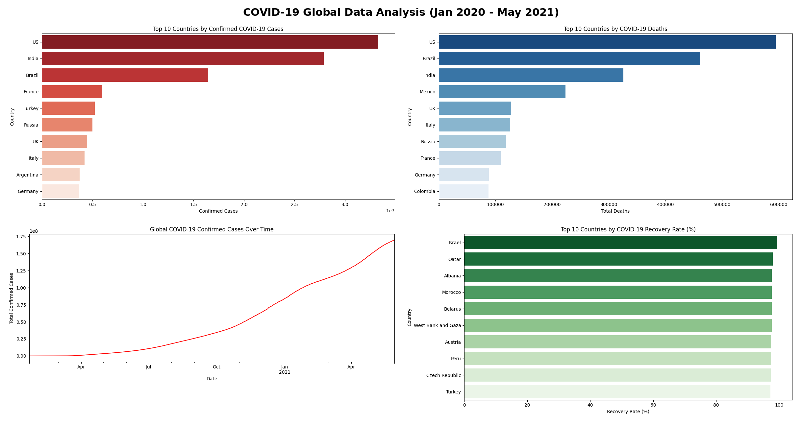

# COVID-19 Global Data Analysis

## Project Overview
Analyzed 306,429 daily COVID-19 records covering 229 countries and regions (January 2020 to May 2021) to compare confirmed cases, deaths, and recovery rates across countries and track global case growth over time.

## Tools Used
- Python
- Pandas
- Matplotlib
- Seaborn

## Key Insights

1. Global confirmed cases reached about 170 million by May 2021
2. The US had the most confirmed cases (33.25 million), followed by India (27.89 million) and Brazil (16.47 million), together nearly half of all global cases
3. The US also had the most deaths (594,306), followed by Brazil (461,057) and India (325,972)
4. Mexico ranked 4th in deaths (223,455) despite not being in the top 10 for confirmed cases, suggesting a much higher fatality rate
5. Global case growth sped up sharply from October 2020 onward, with another steep rise in spring 2021
6. Among countries with over 100,000 cases, Israel had the highest recovery rate (about 99%). Some countries, like the US, did not report recoveries consistently, so recovery rates should be compared carefully

## Data Cleaning Note
The dataset has one row per province or state per day. To get accurate country totals, cases were first summed across all provinces for each country on each date, then each country's peak total was taken.

## Dataset
Novel Corona Virus 2019 Dataset from Kaggle

## View Full Project on Kaggle
https://www.kaggle.com/code/lalitacanada/covid-19-global-data-analysis-key-insights
